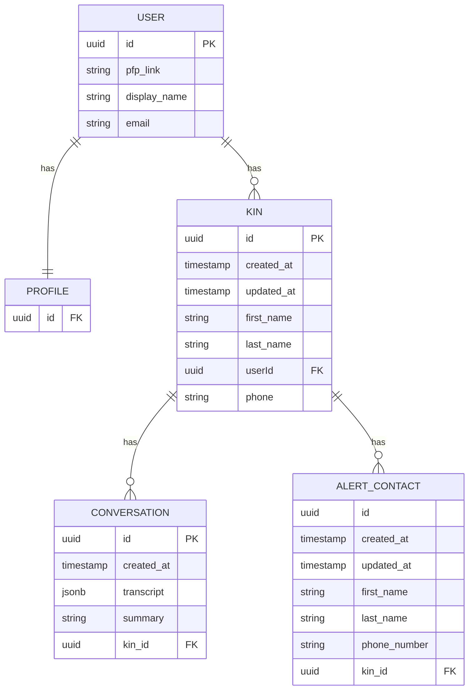

# **KinWell – Project Overview & Design Document**

---

## **1. Project Purpose & Goals**

### **Purpose**

KinWell is an automated phone-based wellness check-in system for elderly family members.
The system calls your “kin” on a scheduled basis, asks them how they are doing, and records the conversation. A caregiver can view summaries, transcripts, and alerts if the call was missed or if the AI detects potential distress.

The goal is to provide **peace of mind**, reduce caregiver burden, and deliver real-time visibility into a loved one’s safety **without requiring any extra hardware**.

---

### **Wellness Check Workflow**

```
[ Scheduled Call ]
        │
        ▼
[ Twilio Phone Call ] 
        │
        ▼
[ AI Agent Speaks + Listens ]
        │
        ▼
[ Transcript + Summary Created ]
        │
        ▼
[ Caregiver Dashboard ]
```

---

### **High-Level Purpose Diagram**

```
          ┌─────────────────┐
          │   Caregivers    │
          │ (Users/Watchmen)│
          └───────┬─────────┘
                  │ view summaries, manage kin
                  ▼
       ┌────────────────────────┐
       │      KinWell App       │
       │ (Next.js + Supabase)   │
       └───────┬────────────┬───┘
               │            │
               ▼            ▼
      ┌─────────────┐   ┌─────────────────┐
      │ Schedules   │   │ Conversations   │
      │ (DB)        │   │ + Alerts (DB)   │
      └──────┬──────┘   └────────┬────────┘
             │                   │
             ▼                   ▼
      ┌───────────┐       ┌─────────────┐
      │ Edge Fn   │──────▶│Twilio (Call)│
      │ Schedulers│       └─────────────┘
      └───────────┘
```

---

## **2. Initial ERD Sketch**



### **Explanation**

* **USER**: A caregiver. This is the authenticated Supabase user.
* **PROFILE**: Extra profile info linked 1:1 with the user.
* **KIN**: An elderly person being monitored; a user can have many kin.
* **CONVERSATION**: Each completed or attempted call, with transcript + summary.
* **ALERT_CONTACT**: People to notify if a call fails or concerning behavior appears.

Relationally, this creates clean ownership:

* User → Kin → Conversations
* User → Kin → Alert Contacts

We do want to move to a many to many table down the road however, that way we can have user groups share kin.

---

## **3. System Architecture Diagram**

```
                          ┌──────────────────────┐
                          │        Client        │
                          │  Next.js Frontend    │
                          └──────────┬───────────┘
                                     │
                                     ▼
                    ┌───────────────────────────────────┐
                    │            Supabase               │
                    │  Auth | Postgres | RLS Policies   │
                    └──────────┬────────────┬───────────┘
                               │            │
              Schedules Query  │            │ Conversations Query
                               │            │
                               ▼            ▼
                     ┌──────────────┐   ┌───────────────┐
                     │ schedules    │   │ conversations │
                     └───────┬──────┘   └───────┬───────┘
                             │                  │
                             ▼                  ▼
                ┌───────────────────┐   ┌──────────────────────┐
                │ Edge Functions    │   │ AI Summary Pipeline  │
                │ (Scheduled Jobs)  │   │ (LLM + ElevenLabs)   │
                └──────────┬────────┘   └────────────┬─────────┘
                           │                         │
                           ▼                         ▼
                   ┌───────────────┐       ┌──────────────────┐
                   │ Twilio (Call) │       │ Transcript + TTS │
                   └───────┬───────┘       └───────┬──────────┘
                           │                       │
                           ▼                       ▼
                ┌────────────────┐       ┌───────────────────────┐
                │ Call Webhook   │──────▶│ Conversation Records  │
                └────────────────┘       └───────────────────────┘
```

### **Key Technologies**

* **Next.js** — UI + API routes
* **Supabase** — Database, Auth, RLS, storage
* **Edge Functions** — Scheduled jobs & event processing
* **Twilio** — Phone calls + webhook events
* **ElevenLabs** — Caller voice
* **LLM (OpenAI/Anthropic)** — AI summaries + future distress detection

---

## **4. Initial Goals**

### **Step 1**

* Configure Supabase tables + RLS
* Create basic UI skeleton (Next.js)

### **Step 2**

* Implement scheduling model
* Build form to create/manage kin
* Test basic authenticated queries

### **Step 3**

* Integrate Twilio phone number
* Implement outgoing call function
* Store initial conversation logs

### **Step 4**

* Build conversation feed UI
* Add transcript + summary fields
* Start AI summarization pipeline

### **Step 5**

* Add ElevenLabs voice generation
* Test complete call flow end-to-end
* Add alert contact management

### **Step 6**

* Implement fallback & failure handling
* Add missed-call detection
* Add alerts UI

### **Step 7**

* Implement Stripe subscriptions
* Lock down RLS + security edge cases
* Polish UI, fix bugs
